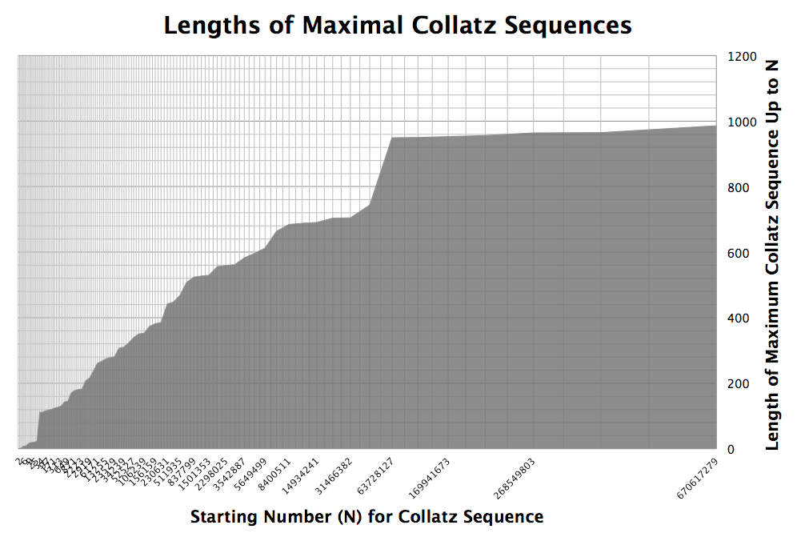

Optimizing a Solution to Project Euler Problem #14 in Haskell
=====================================================

Progressively optimized versions (in Haskell) of a solution to Problem 14 from Project Euler (<http://projecteuler.net/problem=14>):

> The following iterative sequence is defined for the set of positive integers:

> n → n/2 (n is even)

> n → 3n + 1 (n is odd)

> Using the rule above and starting with 13, we generate the following sequence:

> 13 → 40 → 20 → 10 → 5 → 16 → 8 → 4 → 2 → 1

> It can be seen that this sequence (starting at 13 and finishing at 1) contains 10 terms. Although it has not been proved yet (Collatz Problem), it is thought that all starting numbers finish at 1.

> Which starting number, under one million, produces the longest chain?

> NOTE: Once the chain starts the terms are allowed to go above one million.

Starting with a very simple, naïve, declarative solution which runs in about 10 seconds on my machine, I demonstrate a series of optimized versions, each building on the last, the final of which was able to solve the problem in about 0.05 seconds.

The source files are formatted such that one can flip quickly back and forth between them to see changes, as similar code is visually aligned between files. For this reason, I recommend cloning the repository locally, to allow for quick comparison between files.

Each file is commented to (hopefully) elucidate the reasoning behind the opimizations, as well as their operation. **Questions and comments are welcome!**

This process of improvement shows a few neat things about Haskell:

* The simplest possible solution is very simple, and easy to understand, yet still runs in a decent amount of time.
* The monad abstraction facilitates lots of code reuse, especially when altering purely functional code to use mutation for speed.
* Applicative notation (`<$>` and `<*>`) -- once you grok it -- makes for succinct, legible monadic code.

...plus a few other things which are unique to particular implementations.

Every version takes as its first argument the size of problem to solve, with a default of 1,000,000. This may be specified in floating-point notation, like `Version1 1e6`. (Version 6 takes a few other command line options, described below.)

Here's a linear plot of the performance improvements:

")

And more sanely presented as a log-log plot:

")

All tests were performed using a 2.0 GHz Intel Core i7 processor and 16 GB of installed RAM, on Mac OS X 10.9.

Summary of Versions
-------------------

* `Common` contains code common to some or all versions. It imports every other module used by the various versions, and re-exports them. It also defines:
   + the recurrence relation for the Collatz sequence
   + IO accessors to get positional command line arguments
* `MutableArray` contains safe array manipulation functions used by array-based implementations (versions 4-6)
* `Version1` is a naïve, declarative implementation based upon the problem definition. It generates every sequence up to the maximum starting number, and finds the maximum-length sequence. Time to solve: **8.76 s**.
* `Version2` eliminates the generation of a list for each sequence, instead defining a `collatzLength` function which finds the length of a sequence directly. Time to solve: **3.60 s**.
* `Version3` introduces purely functional memoization, in the form of a key-value map encapsulated in a state monad. Time to solve: **1.58 s**.
* `Version4` trades out the purely functional state monad for the `ST` monad, using a mutable array for memoization. Time to solve: **0.52 s**.
* `Version5` eliminates the separate, list-based, maximum-finding step, by using mutable `STRef`s to keep track of the maximum. Time to solve: **0.19 s**.
* `Version6` migrates to the `IO` monad for coordinated parallel computation with global memoization. The `STM` monad prevents thread-synchronization issues in updating the maximum value and in assigning chunks of work to threads. A `Config` datatype is introduced to make passing configuration data less verbose. Time to solve: **0.05 s**.
   + Version 6 takes additional command line arguments after the problem size, in this order: chunk size, cache size, number of cores. An underscore (`_`) denotes that the program should substitute the default for that argument.

Compilation Notes
-----------------

For the results I list, all versions were compiled with `-O2` optimizations turned on, using GHC version 7.6.3 on OS X Mavericks.

Version 4 needs extra stack space and should be compiled with `-rtsopts -with-rtsopts -K50M` (for default problem size), and possibly with larger sizes than `50M` in case of larger problem sizes (the stack space may also be specified at run-time by appending `+RTS -K<size>` in the shell).

Version 6 is multithreaded and must be compiled as such. Use: `-threaded -rtsopts -with-rtsopts -N8`. For best performance on modern processors with hyperthreading, substitute for `8` the number of cores on your machine multiplied by two.

More Results
------------

I plotted the cumulative maxima of all Collatz sequences explored during a 1-billion size run with Version 6. This is shown below:

